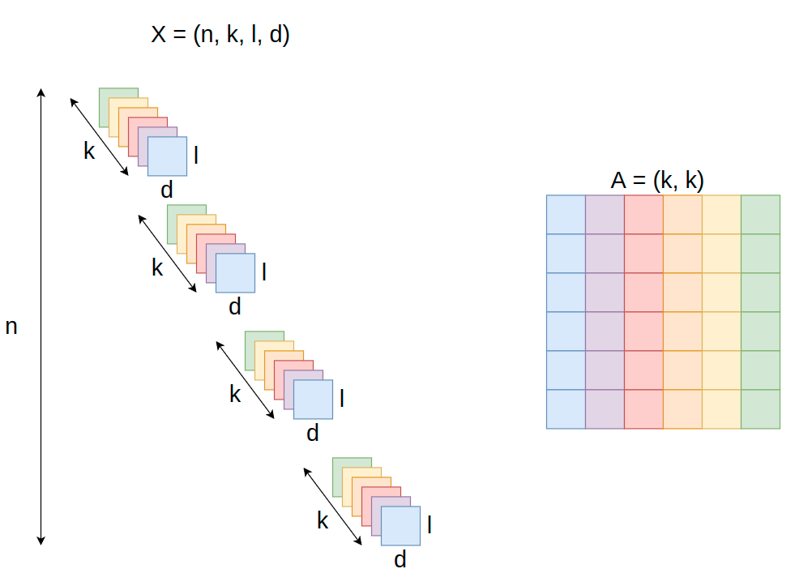

# TensorOperation

## MatMulandEinsum.py
* 比較 Matmul 和 Einsum 的差別。
* X 是 data ，其維度為 (*# data, # node, # time, # feature)
  * 資料的數量: n。
  * 每筆資料有多少 node: k。
  * 每個 node 值會隨時間變化: l。
  * 每個 node 有 d 個 feature: d。
* A 是 adjacency matrix, 代表一張 DAG (Bayesian Network)，其維度為(# node, # node)
* 
* 簡化問題: n=1, k=3, l=1, d=1，於是 X=(1,3,1,1), A=(3,3)
* 
* 計算
* 
* 計算 
* 
* 計算 einsum(NKLD, KJ->NJLD)
* 
